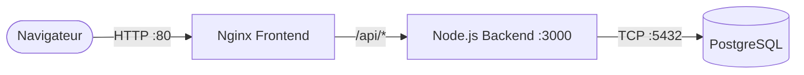

# VitalSync

Application de suivi de santé et d'activités physiques, développée dans le cadre d'une épreuve DevOps EFREI.

## Architecture

VitalSync suit une architecture **3-tiers conteneurisée** :

- **Frontend** — page statique servie par Nginx, avec reverse-proxy vers l'API.
- **Backend** — API REST Node.js / Express exposant les endpoints `/health` et `/api/activities`.
- **Base de données** — PostgreSQL 16 pour la persistance.

L'ensemble est orchestré via Docker Compose en local et déployable sur Kubernetes en production.



## Prérequis

| Outil          | Version minimale |
|----------------|-----------------|
| Node.js        | 20 LTS          |
| Docker         | 24+             |
| Docker Compose | 2.20+           |
| kubectl        | 1.28+           |

## Démarrage rapide avec Docker Compose

```bash
# 1. Créer le fichier d'environnement
cp .env.example .env

# 2. Construire et lancer les services
docker compose up -d --build

# 3. Vérifier le health check
curl http://localhost:3000/health

# 4. Arrêter les services
docker compose down -v
```

## Développement backend (sans Docker)

```bash
cd backend
npm install
npm run lint
npm test
npm start
```

## Pipeline CI/CD

Le fichier `.github/workflows/ci-cd.yml` définit une pipeline GitHub Actions déclenchée sur :
- **push** vers `develop`
- **pull_request** vers `main`

### Jobs

| Job              | Description |
|------------------|-------------|
| `lint-test`      | Installe les dépendances, lint le code et lance les tests Jest dans le dossier `backend`. |
| `build-push`     | Construit les images Docker backend et frontend, puis les pousse sur GHCR avec un tag `SHA`. |
| `deploy-staging` | Lance `docker compose up`, attend le démarrage et vérifie `/health` avant de tear down. |

## Déploiement Kubernetes

```bash
kubectl apply -f k8s/db-secret.yml
kubectl apply -f k8s/backend-deployment.yml
kubectl apply -f k8s/backend-service.yml
kubectl apply -f k8s/frontend-deployment.yml
kubectl apply -f k8s/frontend-service.yml
kubectl apply -f k8s/ingress.yml
```

Accès via `http://vitalsync.local` (nécessite une entrée `/etc/hosts` ou un Ingress Controller configuré).

## Choix techniques

| Choix | Justification |
|-------|---------------|
| **Node.js 20 LTS** | Support long terme, performances I/O asynchrones adaptées à une API REST. |
| **Express** | Framework minimaliste, large écosystème de middlewares, courbe d'apprentissage faible. |
| **PostgreSQL 16** | Base relationnelle robuste, open-source, support JSON natif. |
| **Nginx stable-alpine** | Serveur web léger pour les fichiers statiques, reverse-proxy intégré. |
| **Multi-stage Docker build** | Réduit la taille de l'image finale et exclut les outils de développement/test. |
| **GitHub Actions** | CI/CD intégrée à GitHub, YAML déclaratif, accès natif à GHCR. |
| **Kubernetes** | Orchestration standard, scaling horizontal, liveness probes, rolling updates. |
| **GHCR (GitHub Container Registry)** | Hébergement d'images lié au dépôt, authentification via `GITHUB_TOKEN`. |

## Structure du projet

```
VitalSync/
├── backend/
│   ├── test/
│   │   └── health.test.js
│   ├── .dockerignore
│   ├── .eslintrc.json
│   ├── Dockerfile
│   ├── package.json
│   └── server.js
├── frontend/
│   ├── Dockerfile
│   ├── index.html
│   └── nginx.conf
├── k8s/
│   ├── backend-deployment.yml
│   ├── backend-service.yml
│   ├── db-secret.yml
│   ├── frontend-deployment.yml
│   ├── frontend-service.yml
│   └── ingress.yml
├── .env.example
├── .github/workflows/ci-cd.yml
├── .gitignore
├── docker-compose.yml
└── README.md
```
